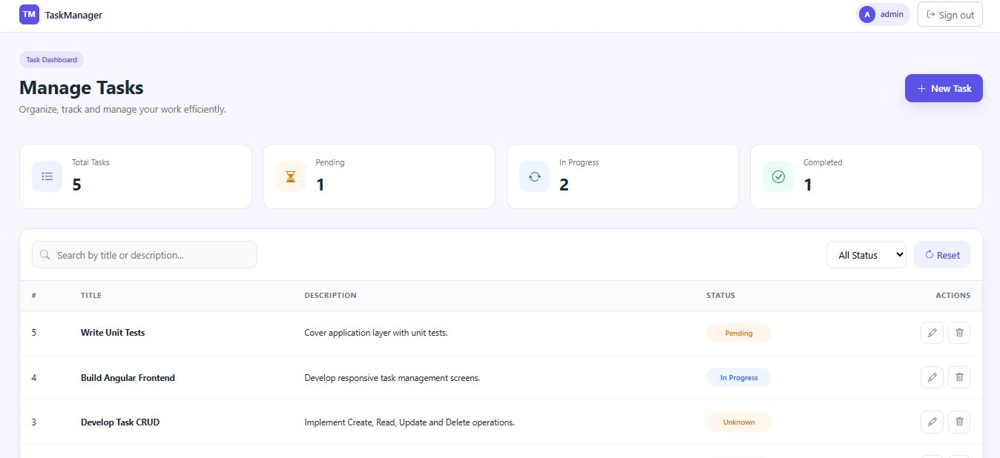
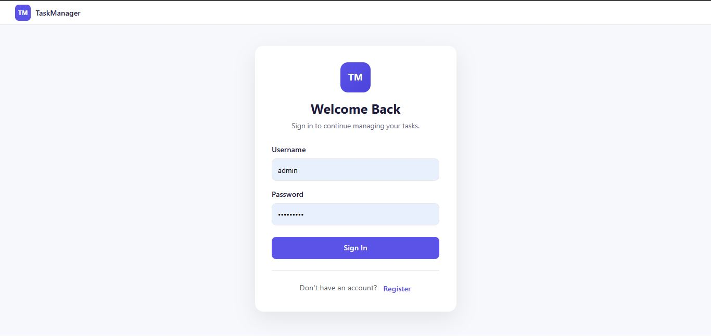
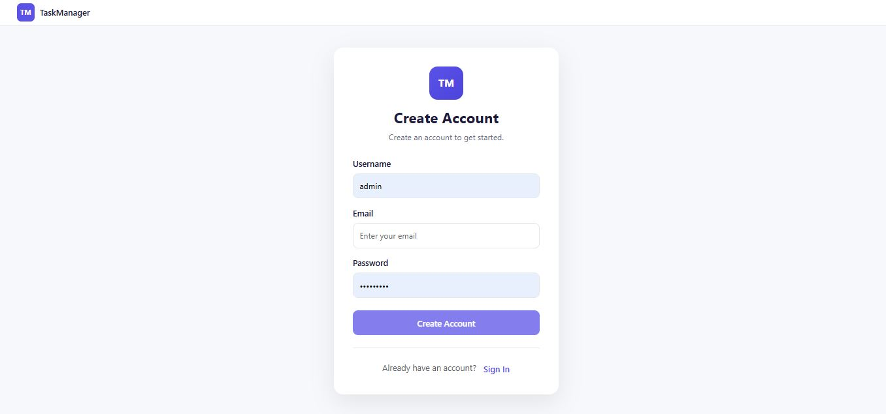
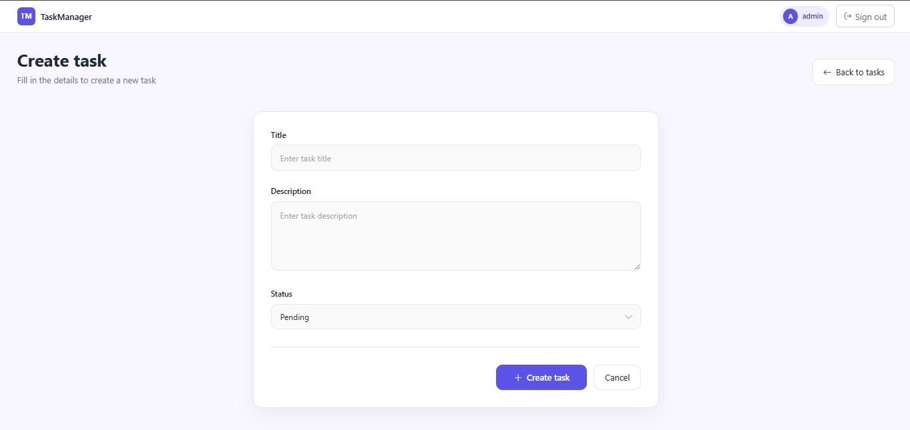
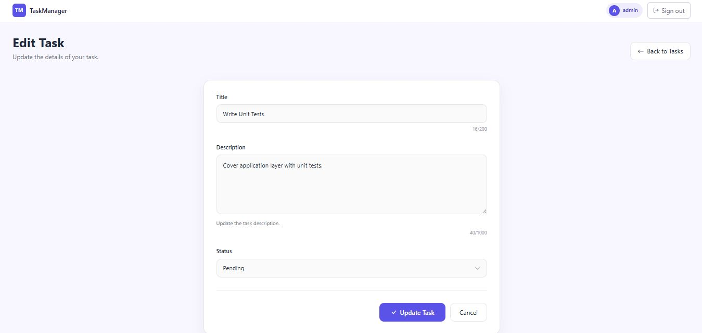
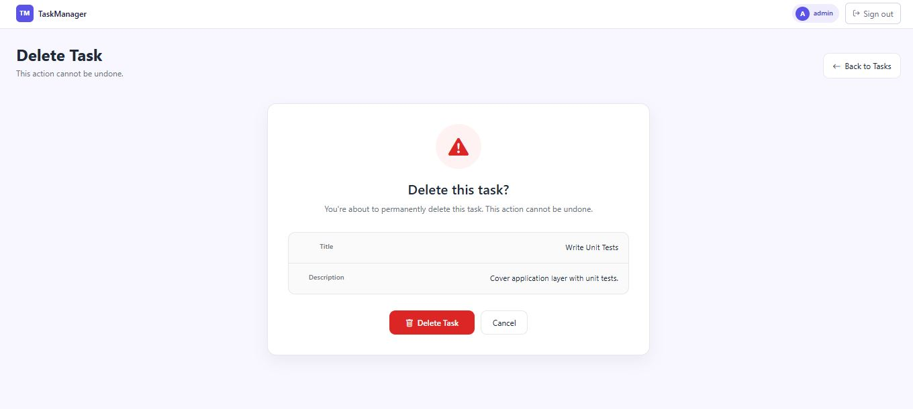

# 📝 Task Manager

A full-stack **Task Management System** built with **ASP.NET Core 10 Web API** and **Angular** following **Clean Architecture** and **CQRS** principles.

The project demonstrates modern software development practices including Entity Framework Core, MediatR, Repository Pattern, Unit of Work, Cookie Authentication, API Versioning, FluentValidation, Serilog Logging, and Angular Standalone Components.

---

# 🚀 Project Highlights

* Clean Architecture
* CQRS with MediatR
* Cookie Authentication
* Password Hashing using BCrypt.Net
* Repository Pattern
* Unit of Work Pattern
* Entity Framework Core
* FluentValidation
* Global Exception Handling
* Serilog Logging
* API Versioning
* Swagger (OpenAPI)
* Angular Standalone Components
* Responsive UI
* Unit Testing using xUnit, Moq and FluentAssertions

---

# ✨ Features

## Authentication

* User Registration
* User Login
* Cookie Authentication
* Password Hashing using BCrypt.Net
* Automatic Administrator User Seeding

## Task Management

* Create Task
* Update Task
* Delete Task
* View Task Details
* View All Tasks
* Task Status Management
* Soft Delete

## Technical Features

* API Versioning
* CQRS with MediatR
* Repository Pattern
* Unit of Work
* FluentValidation
* Global Exception Handling Middleware
* Structured Logging with Serilog
* Swagger Documentation

---

# 🛠 Technologies

## Backend

* ASP.NET Core 10
* C#
* Entity Framework Core
* SQL Server
* MediatR
* Clean Architecture
* Repository Pattern
* Unit of Work
* FluentValidation
* AutoMapper
* BCrypt.Net
* Cookie Authentication
* Serilog
* Swagger (OpenAPI)
* API Versioning

## Frontend

* Angular
* TypeScript
* RxJS
* Bootstrap 5
* HTML5
* SCSS

## Testing

* xUnit
* Moq
* FluentAssertions

---

# 📁 Project Structure

```text
TaskManager
│
├── TaskManager.Api
├── TaskManager.Application
├── TaskManager.Domain
├── TaskManager.Infrastructure
├── TaskManager.Test
├── Taskmanager-UI
│
├── Images
│   ├── dashboard.JPG
│   ├── login.JPG
│   ├── register.JPG
│   ├── create.JPG
│   ├── edit.JPG
│   ├── delete.JPG
│   ├── test-result-1.JPG
│   └── test-result-2.JPG
│
├── README.md
├── .gitignore
└── TaskManager.slnx
```

---

# 📋 Prerequisites

Before running the project, install the following software.

* .NET 10 SDK
* SQL Server
* Node.js (LTS)
* Angular CLI

---

# ⚙️ Getting Started

## 1. Clone the Repository

```bash
git clone https://github.com/YOUR_GITHUB_USERNAME/TaskManager.git
```

```bash
cd TaskManager
```

---

## 2. Configure SQL Server

Open:

```
TaskManager.Api/appsettings.json
```

Update the connection string.

Example

```json
{
  "ConnectionStrings": {
    "DefaultConnection": "Server=.;Database=TaskManagerDb;Trusted_Connection=True;TrustServerCertificate=True;"
  }
}
```

---

## 3. Apply Database Migrations

Open a terminal inside the API project.

```bash
cd TaskManager.Api
```

Run:

```bash
dotnet ef database update
```

This command will:

* Create the database (if it does not already exist)
* Apply all Entity Framework Core migrations
* Create all required tables

---

## 4. Seeded Administrator Account

The application automatically creates a default administrator account during startup.

Use the following credentials to log in.

| Username  | Password      |
| --------- | ------------- |
| **admin** | **Admin@123** |

> Replace the username and password above with the values configured in your `DbInitializer`.

---

## 5. Run the Backend API

```bash
dotnet run
```

The API will start on:

```
https://localhost:7119
```

Swagger UI:

```
https://localhost:7119/swagger
```

> Replace the port if your API uses a different port.

---

## 6. Run the Angular Application

Open another terminal.

```bash
cd Taskmanager-UI
```

Install dependencies.

```bash
npm install
```

Run Angular.

```bash
ng serve
```

Open:

```
http://localhost:4200
```

---

# 🔐 Login

Use the seeded administrator account.

| Username  | Password      |
| --------- | ------------- |
| **admin** | **Admin@123** |

---

# 📖 API Documentation

Swagger documentation is available at:

```
https://localhost:7119/swagger
```

Swagger allows you to:

* Browse all available endpoints
* Execute API requests directly from the browser
* View request and response models
* Verify HTTP status codes

---

# ✅ Running Unit Tests

Run all unit tests.

```bash
dotnet test
```

---

# 📸 Application Screenshots

## Dashboard



---

## Login



---

## Register



---

## Create Task



---

## Edit Task



---

## Delete Task



---

# 🧪 Unit Test Results

## Test Execution


---

## Test Summary


---

# 🏛 Architecture

```text
Angular UI
      │
      ▼
ASP.NET Core Web API
      │
      ▼
Application Layer
(CQRS + MediatR)
      │
      ▼
Domain Layer
      │
      ▼
Infrastructure Layer
(Entity Framework Core + SQL Server)
```

---

# 📐 Design Patterns

* Clean Architecture
* CQRS
* Repository Pattern
* Unit of Work
* Mediator Pattern
* Dependency Injection
* Validation Pipeline
* Global Exception Handling

---

# 📄 License

This project was developed as a technical assessment and learning project.

---

# 👨‍💻 Author

**Chandana Hennayake**

Software Engineer

GitHub: https://github.com/YOUR_GITHUB_USERNAME
